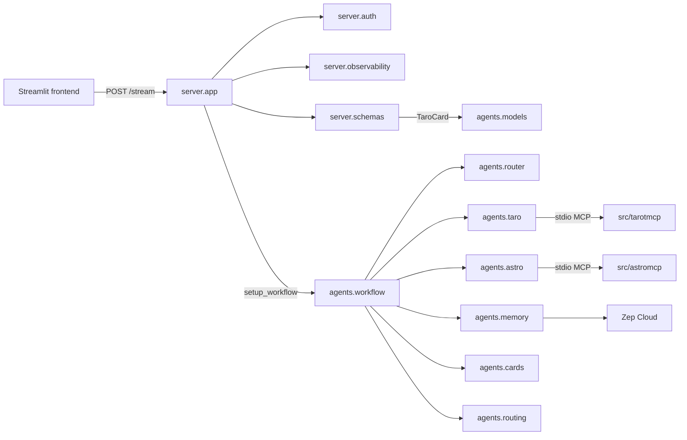

# Phase 9: Backend Structure Refactor - Research

**Researched:** 2026-07-19
**Domain:** Python package restructure (FastAPI + LangGraph) — hard-cut import migration
**Confidence:** HIGH

<user_constraints>
## User Constraints (from CONTEXT.md)

### Locked Decisions
- **D-01:** Use `src/backend/server/` and `src/backend/agents/` — do **not** keep a separate top-level `graph/` package (current `graph/` content moves under `agents/`).
- **D-02:** Strict boundary: `server/` = HTTP only (`app`, `auth`, observability, stream request/response schemas like `ExtractData`/`UserData`). Agent orchestration, LLM factories, prompts, routing, card mapping, and shared domain models used by the graph (`TaroCard`, `AgentState`, etc.) live under `agents/`. Server may import from `agents` for types needed by the API; agent code must not own HTTP entrypoints.
- **D-03:** Entrypoint after move is `uvicorn server.app:app` (run from `src/backend` with existing `pythonpath`). Update README accordingly. No root `app.py` compatibility shim.
- **D-04:** Hard cut in this phase — delete old flat modules (`app.py`, `auth.py`, `graph/`, etc.) after the move; rewrite tests and imports to `server.*` / `agents.*`. No deprecation re-export layer.

### Claude's Discretion
- Exact folder layout **inside** `agents/` (per-agent folders vs files) — not discussed; planner/researcher may propose a clear split by router/taro/astro/memory/card mapping as long as D-01–D-04 hold.
- Whether `ExtractData` stays in `server/schemas.py` vs a thin re-export of card types from `agents` — implement the strict boundary without unnecessary duplication.
- How to update `pytest` `pythonpath` / import paths with minimal churn.

### Deferred Ideas (OUT OF SCOPE)
- Fine-grained per-agent folder layout inside `agents/` was not discussed in this session — left to Claude's discretion / planning.
- Frontend `TaroCard` dedup (v2 FE-02) stays out of scope.

None other — discussion stayed within phase scope.
</user_constraints>

<phase_requirements>
## Phase Requirements

Roadmap lists Requirements as TBD; success criteria below are the planning contract.

| ID | Description | Research Support |
|----|-------------|------------------|
| SC-01 | Clear `server` package (FastAPI app, auth, stream schemas, observability) separate from agent/graph code | Target tree + D-02 boundary; import map |
| SC-02 | Agent/graph code under `agents` package, not mixed with HTTP entrypoints | Target tree; one-way `server → agents` imports |
| SC-03 | Graph split by agent/subagent (router, taro, astro, memory, card mapping, routing) | Recommended `agents/{router,taro,astro,memory,cards}/` layout |
| SC-04 | Public imports + `pytest -q` green; behavior unchanged | Full break map, patch-target table, Validation Architecture |
</phase_requirements>

## Summary

Phase 9 is a **hard-cut rename/move** of the existing `src/backend` layout into `server/` (HTTP) and `agents/` (LangGraph + LLM), with monolithic `nodes.py` / `agent.py` / `prompt.py` split by agent. No new product behavior and **no new PyPI packages**. `pythonpath = ["src/backend"]` should stay unchanged so imports become `server.*` / `agents.*` with minimal pytest config churn.

The highest execution risks are (1) **MCP path depth** after relocating factories (`__file__`-relative `../../../tarotmcp` / `../../../astromcp`), (2) **`unittest.mock.patch` targets** that must follow the import site (`agents.workflow.create_agents`, not the definition module), and (3) **circular imports** if `agents/__init__.py` eagerly pulls workflow + factories + server types. Keep `server → agents` one-way; put `TaroCard` under `agents.models` and let `server.schemas.ExtractData` import it.

**Primary recommendation:** Adopt per-agent packages under `agents/` (same nesting depth as today’s `graph/agents/` so MCP relative paths stay `../../../…`), export `setup_workflow` from `agents/__init__.py`, run `uvicorn server.app:app` from `src/backend`, rewrite all test imports/patches in one cut, delete old modules.

## Architectural Responsibility Map

| Capability | Primary Tier | Secondary Tier | Rationale |
|------------|-------------|----------------|-----------|
| FastAPI `/stream` + lifespan | API / Backend (`server`) | — | HTTP entrypoint only |
| API key auth | API / Backend (`server.auth`) | — | FastAPI dependency |
| Langfuse callback wiring | API / Backend (`server.observability`) | — | Request-scoped stream config |
| Stream I/O schemas (`UserData`, `ExtractData`) | API / Backend (`server.schemas`) | agents.models | HTTP contracts; cards typed via agents |
| Domain card model (`TaroCard`) | API / Backend (`agents.models`) | — | Shared by graph + stream schema |
| Agent state / router outputs / `Agents` | API / Backend (`agents.state`) | — | LangGraph state, not HTTP |
| LLM factories + MCP clients | API / Backend (`agents.*`) | — | Orchestration / tools |
| Graph compile (`setup_workflow`) | API / Backend (`agents.workflow`) | server.app imports it | Public agent API for server |
| Card mapping from ToolMessages | API / Backend (`agents.cards`) | — | Graph post-processing |
| Tool-loop caps | API / Backend (`agents.routing`) | — | Graph routing helper |
| pytest suite | Test runner | — | Import + patch against new modules |
| Streamlit frontend | Browser / Client | — | Calls `/stream` URL only; out of scope |

## Standard Stack

### Core

| Library | Version (env) | Purpose | Why Standard |
|---------|---------------|---------|--------------|
| FastAPI | 0.137.1 `[VERIFIED: uv pip show]` | HTTP app in `server.app` | Already used |
| Uvicorn | 0.49.0 `[VERIFIED: uv pip show]` | ASGI runner `server.app:app` | Already used; module:attr form `[CITED: uvicorn.dev/deployment]` |
| LangGraph | 1.2.5 `[VERIFIED: uv pip show]` | `StateGraph` workflow | Already used |
| pytest | 9.1.0 `[VERIFIED: uv pip show]` | Suite must stay green | Already in `[dependency-groups] dev` |
| pytest-asyncio | (dev group) | Async graph tests | Already configured `asyncio_mode = auto` |

### Supporting

| Library | Version | Purpose | When to Use |
|---------|---------|---------|-------------|
| langchain-mcp-adapters | existing | MultiServerMCPClient in taro/astro factories | Unchanged |
| zep-cloud | existing | Memory tools + add_memory | Unchanged |
| langfuse | existing | Optional callbacks in server | Unchanged |
| pydantic | existing | Schemas / TaroCard | Unchanged |

### Alternatives Considered

| Instead of | Could Use | Tradeoff |
|------------|-----------|----------|
| Keep `pythonpath = ["src/backend"]` | Make installable `aitaro` package | Extra packaging work; **reject** — discretion says minimal churn |
| Flat `agents/*.py` files only | Per-agent folders | Flat fails SC-03 clarity; folders match roadmap |
| Root `app.py` re-export | Hard cut | Forbidden by D-03/D-04 |
| Duplicate `TaroCard` in server | Import from `agents.models` | Duplication violates discretion |

**Installation:** None — refactor only.

```bash
# No new packages. Verify existing env:
uv sync   # or selective install per STATE.md if psycopg2 lacks pg_config
```

**Version verification:** Confirmed via `uv pip show` on this machine 2026-07-19. Lockfile may pin differently; do not add deps in this phase.

## Package Legitimacy Audit

> No external packages are added in this phase.

| Package | Registry | Age | Downloads | Source Repo | Verdict | Disposition |
|---------|----------|-----|-----------|-------------|---------|-------------|
| — | — | — | — | — | — | N/A — no installs |

**Packages removed due to [SLOP] verdict:** none  
**Packages flagged as suspicious [SUS]:** none

## Architecture Patterns

### System Architecture Diagram



### Recommended Project Structure

```
src/backend/
├── server/
│   ├── __init__.py
│   ├── app.py                 # FastAPI lifespan + /stream (was app.py)
│   ├── auth.py                # verify_stream_api_key
│   ├── observability.py       # build_langfuse_callbacks
│   └── schemas.py             # ExtractData, UserData
│                              # from agents.models import TaroCard
└── agents/
    ├── __init__.py            # from .workflow import setup_workflow  (public)
    ├── models.py              # TaroCard (was models.py)
    ├── state.py               # AgentState, RouterOutput, UnlockCard, Summarize, Agents
    ├── routing.py             # MAX_TOOL_ITERATIONS, capped_tools_condition
    ├── factories.py           # async create_agents() aggregator
    ├── workflow.py            # setup_workflow + graph wiring
    ├── config/
    │   ├── __init__.py
    │   └── config.py          # base_url, zep_api
    ├── router/
    │   ├── __init__.py
    │   ├── prompt.py
    │   ├── factory.py         # create_router_agent
    │   └── node.py            # router_node
    ├── taro/
    │   ├── __init__.py
    │   ├── prompt.py
    │   ├── factory.py         # create_tarot_agent — MCP ../../../tarotmcp/...
    │   └── node.py            # taro_node
    ├── astro/
    │   ├── __init__.py
    │   ├── prompt.py
    │   ├── factory.py         # create_astro_agent — MCP ../../../astromcp/...
    │   └── node.py            # astro_node
    ├── memory/
    │   ├── __init__.py
    │   ├── tools.py           # search_facts, search_nodes, module-level zep
    │   ├── prompt.py          # summarize_prompt
    │   ├── factory.py         # create_summarize_agent
    │   └── nodes.py           # take_context, add_memory (or keep closures in workflow)
    └── cards/
        ├── __init__.py
        ├── mapping.py         # extract_cards_from_messages, parsers
        ├── prompt.py          # unlock_card_prompt
        ├── factory.py         # create_card_unlock_agent
        └── node.py            # img_node
```

**Why this layout (discretion recommendation):**
1. Matches SC-03 / roadmap (“split by agent and subagent”).
2. Nesting depth `agents/<agent>/factory.py` equals today’s `graph/agents/agent.py` (3 hops to `src/`), so **MCP relative paths stay `../../../tarotmcp/dist/index.js` and `../../../astromcp/dist/main.js`** with zero formula change. `[VERIFIED: local path math]`
3. Flat `agents/factories.py` alone would require changing `../../../` → `../../` — easy to miss and breaks live MCP at runtime.

### Pattern 1: One-way dependency boundary

**What:** `server` may import `agents`; `agents` must never import `server`.  
**When to use:** Always for this phase (D-02).  
**Example:**

```python
# server/app.py
from agents import setup_workflow
from server.auth import verify_stream_api_key
from server.observability import build_langfuse_callbacks
from server.schemas import ExtractData, UserData

# server/schemas.py
from agents.models import TaroCard
```

### Pattern 2: Public `setup_workflow` export

**What:** `agents/__init__.py` re-exports only `setup_workflow` (same role as today’s `graph/__init__.py`).  
**When to use:** Server lifespan and any test that compiles the graph.

```python
# agents/__init__.py
from .workflow import setup_workflow

__all__ = ["setup_workflow"]
```

Keep `__init__.py` thin — do **not** import all factories/prompts at package import time (circular-import risk).

### Pattern 3: ExtractData placement (discretion)

**Recommendation:** Keep `ExtractData` and `UserData` in `server/schemas.py`. Import `TaroCard` from `agents.models`. Do **not** re-export `ExtractData` from agents; do **not** duplicate `TaroCard` in server. Satisfies D-02 without type duplication.

### Pattern 4: Minimal pytest churn (discretion)

**Recommendation:** Leave `pyproject.toml` as:

```toml
[tool.pytest.ini_options]
pythonpath = ["src/backend"]
```

Only rewrite import strings and patch targets in `tests/`. Do not introduce `src` as pythonpath or editable installs.

### Anti-Patterns to Avoid

- **Root `app.py` shim:** Violates D-03/D-04.
- **`agents` importing `server`:** Breaks D-02; creates cycles with `server.schemas → agents.models`.
- **Moving factories to `agents/*.py` (one level shallower) without fixing MCP paths:** Resolves to repo-root `tarotmcp/` instead of `src/tarotmcp/`.
- **Patching definition modules:** e.g. `patch("agents.factories.create_agents")` while `workflow` did `from .factories import create_agents` — mock never hits. `[CITED: docs.python.org/3/library/unittest.mock.html#where-to-patch]`
- **Leaving old `graph/` or flat `app.py` after cut:** Violates D-04.

## Don't Hand-Roll

| Problem | Don't Build | Use Instead | Why |
|---------|-------------|-------------|-----|
| ASGI process entry | Custom runner script | `uvicorn server.app:app` | Standard module:attr loading |
| Import path hacking | `sys.path` inserts in app code | Existing pytest/`uv run` pythonpath + cwd | Already works |
| Deprecation shims | Re-export old module names | Hard-cut rewrite (D-04) | User locked |
| MCP absolute discovery service | Custom path registry | `__file__`-relative paths at correct depth | Already established |
| New packaging layout | setuptools package rename | Keep `pythonpath = ["src/backend"]` | Minimal churn |

**Key insight:** This phase is mechanical structure + import discipline, not new infrastructure.

## Runtime State Inventory

> Rename/refactor phase — required.

| Category | Items Found | Action Required |
|----------|-------------|------------------|
| Stored data | None — verified: no DB collection/user_id strings tied to Python module paths (`graph.*`). Zep `thread_id` is runtime user id, not module path. | none |
| Live service config | None — verified: Langfuse/Zep/OpenAI keys are env-based; no service dashboards keyed on `graph` or `app.py` module names in-repo. Frontend hardcodes URL `http://127.0.0.1:8000/stream` (path unchanged). | none for module rename; README entrypoint string only |
| OS-registered state | None — verified: no systemd/pm2/task entries in repo; local uvicorn only. | none |
| Secrets/env vars | Env **names** unchanged (`STREAM_API_KEY`, `ZEP_API`, Langfuse keys, LLM base URL). Code that `load_dotenv()` / `os.getenv` moves with modules; keys stay. | code edit only — do not rename secrets |
| Build artifacts | `src/backend/**/__pycache__` under old paths (`graph/`, flat modules). Stale `.pyc` can shadow if partially moved. | delete old packages + clear `__pycache__` after move; no egg-info for backend (not an installed package) |

**Nothing found in category:** Documented explicitly above after repo + path audit.

## Common Pitfalls

### Pitfall 1: MCP path depth wrong after move

**What goes wrong:** Tarot/astro MCP `node` args point at nonexistent `…/AiTaro/tarotmcp/...` instead of `…/AiTaro/src/tarotmcp/...`. Live runs fail; unit tests often miss this (MCP mocked).  
**Why it happens:** Today `os.path.join(dirname(__file__), "../../../tarotmcp/dist/index.js")` from `graph/agents/`. One fewer directory → need `../../`.  
**How to avoid:** Keep factories at `agents/<name>/factory.py` (3 levels under `src/backend`) **or** recompute and assert resolved path ends with `src/tarotmcp/dist/index.js`.  
**Warning signs:** `FileNotFoundError` / MCP spawn failures only outside pytest.

### Pitfall 2: Wrong `patch()` targets

**What goes wrong:** Tests call real `create_agents` / real `AsyncZep` → hangs, network, or MCP spawn.  
**Why it happens:** Patch must target lookup site. After `workflow.py` does `from .factories import create_agents`, patch `agents.workflow.create_agents`. `[CITED: docs.python.org … where-to-patch]`  
**How to avoid:** Maintain the import→patch table below; prefer importing `setup_workflow` **inside** the patch context (current tests already do this — keep that pattern).  
**Warning signs:** Tests suddenly slow, attempt OpenAI/Zep, or fail on missing MCP build.

### Pitfall 3: Circular imports via fat `__init__.py`

**What goes wrong:** `ImportError: cannot import name 'setup_workflow'`.  
**Why it happens:** `agents/__init__.py` imports workflow → factories → state → models while another module imports from `agents` mid-init.  
**How to avoid:** Thin `__init__` exporting only `setup_workflow`; leaf modules use relative imports (`from ..models import TaroCard`).  
**Warning signs:** Failures only on `from agents import setup_workflow`, not on `from agents.workflow import …`.

### Pitfall 4: Running uvicorn from wrong cwd

**What goes wrong:** `ModuleNotFoundError: No module named 'server'`.  
**Why it happens:** `server` is found because cwd/`pythonpath` is `src/backend`.  
**How to avoid:** README keeps `cd src/backend` then `uv run uvicorn server.app:app --reload --port 8000`. `[CITED: uvicorn module:attr form]`  
**Warning signs:** Works under pytest (pythonpath set) but not when started from repo root.

### Pitfall 5: Partial hard cut leaves dual trees

**What goes wrong:** Ambiguous imports / stale modules still imported.  
**Why it happens:** Incomplete D-04.  
**How to avoid:** Single PR/plan wave: move → rewrite imports → delete old paths → `rg "from graph|import graph|from auth import|from models import"` must be empty under `src/backend` and `tests`.  
**Warning signs:** Both `graph/` and `agents/` present after “done”.

### Pitfall 6: `unlock_card_agent` appears unused

**What goes wrong:** Over-eager deletion changes `create_agents` / `Agents` dataclass shape → test fixtures break.  
**Why it happens:** Agent is constructed but not wired into `StateGraph` today.  
**How to avoid:** Move it under `agents/cards/` unchanged; do not delete in this phase (behavior/API surface unchanged).  
**Warning signs:** `make_mock_agents` missing `unlock_card_agent` kwarg.

## Code Examples

### setup_workflow export + server import

```python
# agents/__init__.py
from .workflow import setup_workflow

__all__ = ["setup_workflow"]

# server/app.py  (entrypoint object name must remain `app`)
from agents import setup_workflow
```

### MCP path (keep depth)

```python
# agents/taro/factory.py — same depth as old graph/agents/agent.py
tarot_mcp_path = os.path.abspath(
    os.path.join(os.path.dirname(__file__), "../../../tarotmcp/dist/index.js")
)
# Resolves to <repo>/src/tarotmcp/dist/index.js
```

### Patch where used

```python
# tests/test_router.py — after move
with (
    patch("agents.workflow.create_agents", AsyncMock(return_value=mock_agents)),
    patch("agents.workflow.AsyncZep", return_value=mock_zep),
):
    from agents.workflow import setup_workflow
    compiled = await setup_workflow()
```

```python
# tests/test_memory_tools.py
from agents.memory.tools import search_facts, search_nodes

with patch("agents.memory.tools.zep.graph.search", AsyncMock(...)):
    ...
```

## State of the Art

| Old Approach | Current Approach (post Phase 9) | When Changed | Impact |
|--------------|----------------------------------|--------------|--------|
| Flat `app.py` + nested `graph/agents/` | `server/` + top-level `agents/` | Phase 9 | Clear HTTP vs orchestration |
| Monolithic `nodes.py` / `agent.py` / `prompt.py` | Per-agent modules | Phase 9 | Matches SC-03 |
| `uvicorn app:app` | `uvicorn server.app:app` | Phase 9 | Explicit package entry |
| Soft re-exports | Hard cut | Phase 9 (locked) | One import vocabulary |

**Deprecated/outdated:**
- Importing `graph.*`, bare `auth` / `models` / `schemas` / `observability` from pythonpath root after this phase.

## Complete Import Break Map

### Production modules (current → target)

| Current path | Target path |
|--------------|-------------|
| `app.py` | `server/app.py` |
| `auth.py` | `server/auth.py` |
| `observability.py` | `server/observability.py` |
| `schemas.py` | `server/schemas.py` |
| `models.py` | `agents/models.py` |
| `graph/__init__.py` | `agents/__init__.py` (export `setup_workflow`) |
| `graph/nodes.py` | `agents/workflow.py` + per-agent `node.py` |
| `graph/routing.py` | `agents/routing.py` |
| `graph/taro_card_mapping.py` | `agents/cards/mapping.py` |
| `graph/agents/agent.py` | split → `agents/*/factory.py`, `agents/memory/tools.py`, `agents/factories.py` |
| `graph/agents/prompt.py` | split → `agents/*/prompt.py` |
| `graph/agents/schemas.py` | `agents/state.py` |
| `graph/agents/config/*` | `agents/config/*` |

### Internal import rewrites (src/backend)

| File (new) | Old import | New import |
|------------|------------|------------|
| `server/app.py` | `from auth import …` | `from server.auth import …` |
| `server/app.py` | `from observability import …` | `from server.observability import …` |
| `server/app.py` | `from schemas import …` | `from server.schemas import …` |
| `server/app.py` | `from graph import setup_workflow` | `from agents import setup_workflow` |
| `server/schemas.py` | `from models import TaroCard` | `from agents.models import TaroCard` |
| `agents/state.py` | `from models import TaroCard` | `from agents.models import TaroCard` or relative |
| `agents/cards/mapping.py` | `from models import TaroCard` | `from agents.models import TaroCard` |

### Test import + patch map (ALL breakages)

| File | Current | After |
|------|---------|-------|
| `tests/conftest.py` | `from graph.agents.schemas import Agents, RouterOutput, Summarize` | `from agents.state import Agents, RouterOutput, Summarize` |
| `tests/test_observability.py` | `from observability import …` | `from server.observability import …` |
| `tests/test_stream_endpoint.py` | `from auth import …` / `from schemas import …` | `from server.auth import …` / `from server.schemas import …` |
| `tests/test_routing.py` | `from graph.routing import …` | `from agents.routing import …` |
| `tests/test_taro_cards.py` | `from models import TaroCard` | `from agents.models import TaroCard` |
| `tests/test_taro_cards.py` | `from graph.taro_card_mapping import …` | `from agents.cards.mapping import …` |
| `tests/test_memory_tools.py` | `from graph.agents.agent import search_facts, search_nodes` | `from agents.memory.tools import …` |
| `tests/test_memory_tools.py` | `patch("graph.agents.agent.zep.graph.search")` | `patch("agents.memory.tools.zep.graph.search")` |
| `tests/test_router.py` | `patch("graph.nodes.create_agents")` | `patch("agents.workflow.create_agents")` |
| `tests/test_router.py` | `patch("graph.nodes.AsyncZep")` | `patch("agents.workflow.AsyncZep")` *or* patch site if Zep moves to `memory.nodes` |
| `tests/test_router.py` | `from graph.nodes import setup_workflow` | `from agents.workflow import setup_workflow` |
| `tests/test_add_memory_resilience.py` | same patches as router | same new targets as router / memory nodes |

**Post-cut grep gate (must be empty):**

```bash
rg -n "from graph|import graph|from auth import|from schemas import|from models import|from observability import|uvicorn app:app" src/backend tests README.md
```

## Assumptions Log

| # | Claim | Section | Risk if Wrong |
|---|-------|---------|---------------|
| A1 | Prefer per-agent folders over flat files for SC-03 | Architecture | Planner may choose flatter split; MCP path math changes |
| A2 | Prefer keeping `take_context`/`add_memory` in `agents/memory/nodes.py` vs closures inside `workflow.py` | Architecture | Patch target for `AsyncZep` shifts — update patch table |
| A3 | No live service configs encode old module paths | Runtime State | Unlikely; only local undocumented ops would break |

**If wrong:** A1/A2 are discretion — planner picks one and updates patch map; not user blockers.

## Open Questions (RESOLVED)

1. **Where should `AsyncZep` live for take_context/add_memory?** — **RESOLVED**
   - **Decision:** Keep `AsyncZep` import + construction inside `agents/workflow.py` (`setup_workflow`). Keep `take_context` / `add_memory` as nested closures there (same as today’s `graph/nodes.py`).
   - **Patch site:** `agents.workflow.AsyncZep` (and `agents.workflow.create_agents`).
   - **Rationale:** Stable test patch targets; avoids shifting mocks if memory nodes were extracted.

2. **Should `create_agents` stay one function in `agents/factories.py`?** — **RESOLVED**
   - **Decision:** Yes — thin async aggregator in `agents/factories.py` calling per-agent factories; returns the same `Agents` dataclass fields.
   - **Rationale:** Preserves mock/`make_mock_agents` shape; workflow imports `create_agents` from factories (patch at lookup site `agents.workflow.create_agents`).

## Environment Availability

| Dependency | Required By | Available | Version | Fallback |
|------------|------------|-----------|---------|----------|
| Python | All | ✓ | 3.12.3 | — |
| uv | Deps / uvicorn | ✓ | 0.11.6 | — |
| pytest | Validation | ✓ | 9.1.0 (env) | — |
| uvicorn | Entrypoint | ✓ | 0.49.0 (env) | — |
| node | MCP live runs only | ✓ | v24.16.0 | Unit tests mock MCP — not required for pytest green |
| src/tarotmcp/dist/index.js | Live tarot MCP | ✗ (not built in this env) | — | Build via README; pytest does not need it |
| src/astromcp/dist/main.js | Live astro MCP | ✗ / deferred v2 | — | Same; factories still move paths correctly |
| .planning/config.json | Nyquist toggle | ✗ absent | — | Defaults: nyquist_validation=true, security_enforcement=true |

**Missing dependencies with no fallback:** none for this refactor (pytest is enough for SC-04).

**Missing dependencies with fallback:** MCP dist builds — only for manual live smoke; optional Wave note.

## Validation Architecture

### Test Framework

| Property | Value |
|----------|-------|
| Framework | pytest 9.x + pytest-asyncio (asyncio_mode=auto) |
| Config file | `pyproject.toml` → `[tool.pytest.ini_options]` |
| Quick run command | `python -m pytest -q` |
| Full suite command | `python -m pytest -q` (same — suite is small) |

### Phase Requirements → Test Map

| Req ID | Behavior | Test Type | Automated Command | File Exists? |
|--------|----------|-----------|-------------------|-------------|
| SC-01 | Server modules importable; auth/schemas/observability under `server` | unit / import | `python -m pytest tests/test_stream_endpoint.py tests/test_observability.py -q` | ✅ rewrite imports |
| SC-02 | `setup_workflow` from `agents`; no HTTP in agents | unit | `python -m pytest tests/test_router.py tests/test_add_memory_resilience.py -q` | ✅ rewrite patches |
| SC-03 | Routing / cards / memory tools resolve under split packages | unit | `python -m pytest tests/test_routing.py tests/test_taro_cards.py tests/test_memory_tools.py -q` | ✅ rewrite imports |
| SC-04 | Full suite green; behavior unchanged | suite | `python -m pytest -q` | ✅ all 8 test modules |
| D-03 | README documents `uvicorn server.app:app` | manual / grep | `rg "uvicorn server.app:app" README.md` | ❌ Wave 0 doc check |
| D-04 | No leftover `graph/` or flat shims | grep gate | `rg` gate above | ❌ Wave 0 assert |

Existing tests (keep green after import rewrites):

| Test file | Count | Covers |
|-----------|-------|--------|
| `test_stream_endpoint.py` | 2 | Auth + ExtractData stream shape |
| `test_observability.py` | 1 | Langfuse no-keys → empty callbacks |
| `test_routing.py` | 1 | Tool-loop cap |
| `test_taro_cards.py` | 3 | MCP card mapping |
| `test_memory_tools.py` | 2 | Zep search tools |
| `test_router.py` | 1 (parametrized ×3) | Router intents |
| `test_add_memory_resilience.py` | 1 | Zep write failure resilience |

### Sampling Rate

- **Per task commit:** `python -m pytest -q`
- **Per wave merge:** `python -m pytest -q`
- **Phase gate:** Full suite green before `/gsd-verify-work`; plus grep gate for old imports; plus README entrypoint string.

### Wave 0 Gaps

- [ ] Plan task: rewrite all test imports/patches (files exist; contents stale relative to new tree) — not a new framework
- [ ] Plan task: README entrypoint + layout section update
- [ ] Plan task: post-move grep gate for `graph.` / bare `auth`/`models` imports
- [ ] Optional: one assertion or comment in taro/astro factory documenting expected MCP absolute suffix `src/tarotmcp/dist/index.js`

None — existing pytest infrastructure covers behavioral SC-04 once imports/patches are updated. No new test framework install.

## Security Domain

### Applicable ASVS Categories

| ASVS Category | Applies | Standard Control |
|---------------|---------|-----------------|
| V2 Authentication | no (no user login change) | — |
| V3 Session Management | no | — |
| V4 Access Control | yes (unchanged) | `server.auth.verify_stream_api_key` + `STREAM_API_KEY` |
| V5 Input Validation | yes | Pydantic `UserData` / `ExtractData` in `server.schemas` |
| V6 Cryptography | yes (compare) | `secrets.compare_digest` in auth — move file only, do not alter |

### Known Threat Patterns for this stack

| Pattern | STRIDE | Standard Mitigation |
|---------|--------|---------------------|
| Missing/invalid API key on `/stream` | Spoofing | Existing header/Bearer check — relocate only |
| Timing-unsafe key compare | Information disclosure | Keep `secrets.compare_digest` |
| Accidental auth bypass via shim | Elevation | No compatibility shims (D-03/D-04) |
| Secret leakage in new paths | Information disclosure | Do not commit `.env`; env names unchanged |

Refactor must not weaken auth. No new endpoints.

## Project Constraints (from .cursor/rules/)

No `.cursor/rules/` directory found in the project root. No additional rule directives beyond CONTEXT.md and user rules (uv-only Python deps — N/A here since no new packages; functional style; no fallbacks).

## Sources

### Primary (HIGH confidence)

- Codebase audit: `src/backend/**`, `tests/**`, `pyproject.toml`, `README.md` — import/patch/MCP path inventory `[VERIFIED: ripgrep + Read]`
- Local MCP path resolution math for current vs proposed layouts `[VERIFIED: python os.path]`
- `uv pip show` versions for fastapi/uvicorn/langgraph/pytest `[VERIFIED: local env]`

### Secondary (MEDIUM confidence)

- Uvicorn ASGI `path.to.module:instance.path` form `[CITED: https://uvicorn.dev/deployment/]` / `[CITED: https://www.uvicorn.org/deployment/]`
- `unittest.mock` where-to-patch `[CITED: https://docs.python.org/3/library/unittest.mock.html#where-to-patch]`
- Phase CONTEXT / ROADMAP / STATE locked decisions `[VERIFIED: project files]`

### Tertiary (LOW confidence)

- Context7 / ctx7 unavailable this session — LangGraph “modular nodes” guidance not fetched from official docs; split driven by roadmap SC-03 + codebase structure `[ASSUMED]` for framework-best-practice claims only (not for import map)

## Metadata

**Confidence breakdown:**
- Standard stack: HIGH — reuse existing deps; versions verified locally
- Architecture: HIGH — constrained by D-01–D-04; target tree + MCP depth verified
- Pitfalls: HIGH — patch-site and MCP path confirmed against official docs + local math

**Research date:** 2026-07-19  
**Valid until:** 2026-08-18 (30 days — structural refactor; stack stable)
