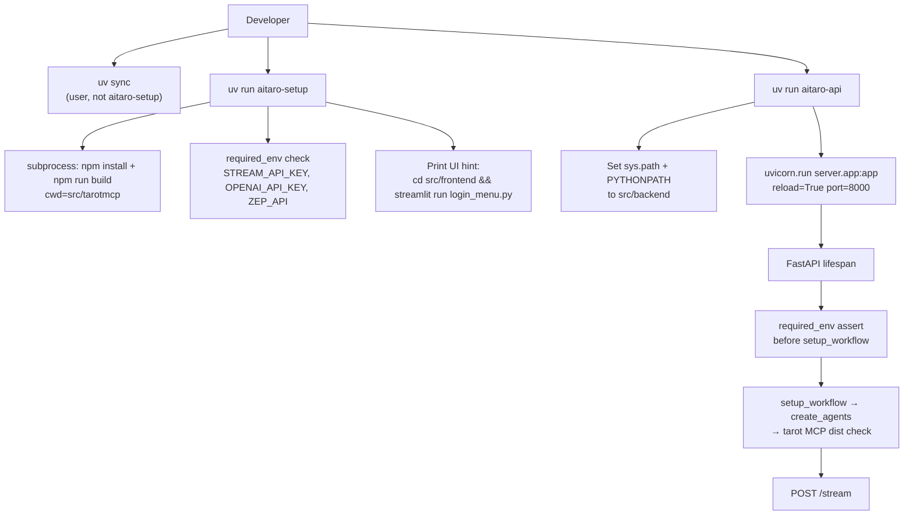

# Phase 10: Simple Startup - Research

**Researched:** 2026-07-20
**Domain:** uv console entrypoints, FastAPI lifespan fail-fast, npm MCP build orchestration
**Confidence:** HIGH

<user_constraints>
## User Constraints (from CONTEXT.md)

### Locked Decisions
### Launch surface
- **D-01:** Use `[project.scripts]` / `uv run` entrypoints — at least `aitaro-setup` and `aitaro-api` (not ad-hoc shell-only as the primary path).
- **D-02:** `aitaro-setup` does MCP build (`npm install`/`npm run build` in `src/tarotmcp`) + env checklist only — does **not** run `uv sync`.
- **D-03:** Runtime entrypoint is **API only** (`aitaro-api`). No `aitaro-ui` entrypoint in this phase; Streamlit stays as a documented separate command.
- **D-04:** `aitaro-api` uses fixed defaults: uvicorn `--reload --port 8000` (no argv pass-through required).

### PYTHONPATH / packaging
- **D-05:** Remove manual `PYTHONPATH=src/backend` via a **wrapper only** — entrypoint sets path/`sys.path` to `src/backend`. Do **not** convert to an editable installable package layout in this phase.
- **D-06:** Entrypoint modules live under repo-root `scripts/` (e.g. `scripts/aitaro_api.py`, `scripts/aitaro_setup.py`) registered in `pyproject.toml` `[project.scripts]`.
- **D-07:** Leave pytest `[tool.pytest.ini_options] pythonpath` unchanged (keep working `src/backend` / repo-root config as-is).
- **D-08:** README Quick start must **not** document raw `PYTHONPATH=… uvicorn …` — canonical path is `uv run aitaro-api` only.

### Env fail-fast
- **D-09:** Required backend env: `STREAM_API_KEY`, `OPENAI_API_KEY`, `ZEP_API`.
- **D-10:** Validate in **both** places: `aitaro-setup` checklist and FastAPI lifespan (before `setup_workflow()` / MCP init). Missing vars → non-zero exit / startup failure.
- **D-11:** Error format: compact list of missing keys + hint to copy `.env.example` → `.env`.
- **D-12:** Langfuse / Qdrant / HuggingFace / other optional keys are **not** checked and not warned in fail-fast.

### Frontend in setup
- **D-13:** Setup does not start Streamlit; it prints a short checklist including the Streamlit command.
- **D-14:** Do **not** validate `POSTGRESQL_*` in setup — only a text reminder that UI needs them.
- **D-15:** Canonical Streamlit entry remains `login_menu.py` (from `src/frontend`).
- **D-16:** README Quick start is **4 steps**: `.env` → `uv sync` → `uv run aitaro-setup` → `uv run aitaro-api`, plus one line for UI.

### Claude's Discretion
- Exact Python packaging metadata to expose `scripts/` as console scripts under uv (setuptools vs hatchling) — pick the smallest change that makes `uv run aitaro-api` work.
- Whether env check is a shared helper module imported by both setup and lifespan.
- Wording of setup stdout checklist.
- Keeping existing tarot MCP missing-dist `FileNotFoundError` message aligned with `aitaro-setup`.

### Deferred Ideas (OUT OF SCOPE)
- `aitaro-ui` Streamlit entrypoint — explicitly out for this phase (D-03).
- Editable installable package layout for `server`/`agents` — deferred (D-05).
- Pass-through uvicorn CLI flags — deferred (D-04).

None other — discussion stayed within phase scope.
</user_constraints>

## Summary

AiTaro today is a **virtual uv project** (no `[build-system]`, no `[project.scripts]`). Backend launch requires `PYTHONPATH=src/backend uv run uvicorn server.app:app --reload --port 8000`. Tarot MCP must be built under `src/tarotmcp` before `create_tarot_agent()` runs. Required env keys exist in `.env.example` but are not fail-fast validated before MCP/LLM init — `STREAM_API_KEY` only fails per-request with HTTP 500 in auth. [VERIFIED: local codebase]

Phase 10 adds the smallest packaging surface that makes `uv run aitaro-setup` / `uv run aitaro-api` work: declare a build backend, ship **only** flat modules from `scripts/`, wrappers that put `src/backend` on `sys.path` **and** `PYTHONPATH` (for uvicorn reload children), shared env validation used by setup + lifespan before `setup_workflow()`, and subprocess npm build with `cwd=src/tarotmcp`. [CITED: docs.astral.sh/uv/concepts/projects/config/]

**Primary recommendation:** Use **setuptools** `[build-system]` + explicit `py-modules` + `package-dir = {"" = "scripts"}` (never auto-discover `src/`), shared helper `src/backend/server/required_env.py`, lifespan check before `await setup_workflow()`, and `uvicorn.run("server.app:app", reload=True, port=8000)` after path/env setup.

## Architectural Responsibility Map

| Capability | Primary Tier | Secondary Tier | Rationale |
|------------|-------------|----------------|-----------|
| Console entrypoints (`aitaro-setup`, `aitaro-api`) | API / Backend (CLI wrappers) | — | Repo-root scripts invoke backend tooling; not browser |
| Required env validation | API / Backend | — | Fail before workflow/MCP; shared by setup CLI + FastAPI lifespan |
| Tarot MCP `npm install`/`build` | API / Backend (setup CLI) | CDN/Static N/A | Node build is a local prep step owned by setup |
| Uvicorn + FastAPI process | API / Backend | — | `server.app:app` already owns HTTP |
| Streamlit UI docs / reminder | Browser / Client (docs only) | — | D-03/D-13: print only; no start |
| pytest path config | API / Backend (tests) | — | Leave `[tool.pytest.ini_options] pythonpath` unchanged (D-07) |

## Project Constraints (from .cursor/rules/)

None — `.cursor/rules/` is absent in this repo. Follow CONTEXT.md locked decisions and global user coding rules (uv-only Python deps, no default params in new Python APIs, raise explicitly).

## Standard Stack

### Core

| Library | Version | Purpose | Why Standard |
|---------|---------|---------|--------------|
| uv | 0.11.6 (local) | Project runner + installs `[project.scripts]` | Already project standard; entry points require build system [CITED: docs.astral.sh/uv/concepts/projects/config/] |
| setuptools | ≥61 (build-system only) | Package only `scripts/*.py` as `py-modules` | Explicit discovery avoids auto-packing `src/`; `scripts` is excluded from flat auto-discovery [CITED: setuptools.pypa.io package_discovery] |
| uvicorn | 0.35.0 (locked in env) | ASGI server with reload | Already a dependency; programmatic `uvicorn.run` [CITED: uvicorn.dev/deployment/] |
| fastapi | 0.116.1 | Lifespan fail-fast hook | Already hosts `lifespan` in `server/app.py` [CITED: fastapi.tiangolo.com/advanced/events/] |
| python-dotenv | already depended | Load `.env` before checks | Already used in auth/config/workflow [VERIFIED: local codebase] |
| Node.js / npm | node v24.16.0 / npm 11.13.0 (local) | Tarot MCP build | `package.json` build copies `card-data.json` [VERIFIED: local codebase] |

### Supporting

| Library | Version | Purpose | When to Use |
|---------|---------|---------|-------------|
| subprocess (stdlib) | — | `npm install` / `npm run build` | Only inside `aitaro-setup` |
| pathlib / sys / os (stdlib) | — | Repo root + `sys.path` / `PYTHONPATH` | Wrappers only |

### Alternatives Considered

| Instead of | Could Use | Tradeoff |
|------------|-----------|----------|
| setuptools `py-modules` + `package-dir` | hatchling `force-include` | Hatchling works but needs extra force-include / bypass-selection; setuptools maps flat `scripts/*.py` more directly [CITED: hatch.pypa.io config/build] |
| setuptools | `uv_build` (uv init --package default) | Fine for new packaged apps; less documented for “scripts-only, do not ship src/backend” |
| Shared helper in `server/` | Duplicate check in scripts + lifespan | Violates DRY; helper in `server/` reuses pytest `pythonpath` |

**Installation (build metadata only — no new runtime deps):**

```toml
[project.scripts]
aitaro-setup = "aitaro_setup:main"
aitaro-api = "aitaro_api:main"

[build-system]
requires = ["setuptools>=61"]
build-backend = "setuptools.build_meta"

[tool.setuptools]
py-modules = ["aitaro_api", "aitaro_setup"]

[tool.setuptools.package-dir]
"" = "scripts"
```

Do **not** set `packages = find` under `src` — that would package backend/frontend/MCP (contradicts D-05). [CITED: setuptools.pypa.io package_discovery]

**Version verification:** uvicorn `0.35.0`, fastapi `0.116.1` via `uv run python`; hatchling latest on PyPI `1.31.0` (not recommended for this phase); setuptools present in environment `68.1.2`. [VERIFIED: local registry/env]

## Package Legitimacy Audit

> No **new runtime** PyPI packages. Only adding `setuptools` as a **build-system require**. Existing runtime deps (uvicorn, fastapi, python-dotenv) stay as-is.

| Package | Registry | Age | Downloads | Source Repo | Verdict | Disposition |
|---------|----------|-----|-----------|-------------|---------|-------------|
| setuptools | PyPI | years (build backend) | n/a (seam null) | github.com/pypa/setuptools | seam SUS (false + on metrics) | **Approved** — PyPA official; build-system only |
| hatchling | PyPI | years | n/a | github.com/pypa/hatch | seam SUS | **Not selected** (alternative only) |
| uvicorn / fastapi / python-dotenv | PyPI | already in `pyproject.toml` | n/a | official repos | seam SUS | **Already approved** — no install change |

**Packages removed due to [SLOP] verdict:** none  
**Packages flagged as suspicious [SUS]:** legitimacy seam returned SUS for well-known packages due to missing download signals / “too-new” — **do not** add human-verify checkpoints for setuptools/uvicorn/fastapi; treat as Approved for this phase.

## Architecture Patterns

### System Architecture Diagram



### Recommended Project Structure

```
scripts/
├── aitaro_api.py      # path wrapper + uvicorn.run
└── aitaro_setup.py    # npm build + env checklist + UI hint
src/backend/server/
├── app.py             # lifespan: validate env then setup_workflow
├── required_env.py    # NEW shared helper (discretion)
├── auth.py            # leave pytest pythonpath; auth still secondary guard
└── ...
src/tarotmcp/          # npm cwd for setup
pyproject.toml         # [project.scripts] + setuptools py-modules only
README.md              # 4 steps + one UI line
```

### Pattern 1: Minimal setuptools scripts packaging

**What:** Install only two top-level modules from `scripts/` so `[project.scripts]` resolves `aitaro_api:main` / `aitaro_setup:main`.  
**When to use:** Always for this phase (D-01, D-06).  
**Example:**

```toml
# Source: https://docs.astral.sh/uv/concepts/projects/config/#command-line-interfaces
# Source: https://setuptools.pypa.io/en/latest/userguide/package_discovery.html
[project.scripts]
aitaro-setup = "aitaro_setup:main"
aitaro-api = "aitaro_api:main"

[build-system]
requires = ["setuptools>=61"]
build-backend = "setuptools.build_meta"

[tool.setuptools]
py-modules = ["aitaro_api", "aitaro_setup"]

[tool.setuptools.package-dir]
"" = "scripts"
```

### Pattern 2: Path wrapper that survives uvicorn reload

**What:** Insert `src/backend` on `sys.path` **and** prepend the same path to `os.environ["PYTHONPATH"]` before `uvicorn.run(..., reload=True)`. Reload spawns a child that re-imports `server.app:app`; `sys.path` alone in the parent is not enough. [CITED: uvicorn.dev/deployment/] [ASSUMED: child inherits PYTHONPATH — standard process env inheritance]

**When to use:** `aitaro_api.main` only.

**Example:**

```python
# Source pattern: uvicorn import-string + reload (https://uvicorn.dev/deployment/)
from pathlib import Path
import os
import sys

def find_repo_root() -> Path:
    start = Path.cwd().resolve()
    for candidate in (start, *start.parents):
        if (candidate / "pyproject.toml").is_file() and (candidate / "src" / "backend").is_dir():
            return candidate
    raise RuntimeError(
        "Could not find AiTaro repo root (pyproject.toml + src/backend). "
        "Run uv run aitaro-api from the repository."
    )

def ensure_backend_on_path() -> Path:
    root = find_repo_root()
    backend = root / "src" / "backend"
    backend_str = str(backend)
    if backend_str not in sys.path:
        sys.path.insert(0, backend_str)
    existing = os.environ.get("PYTHONPATH", "")
    parts = [p for p in existing.split(os.pathsep) if p]
    if backend_str not in parts:
        os.environ["PYTHONPATH"] = backend_str if not parts else backend_str + os.pathsep + existing
    return root

def main() -> None:
    ensure_backend_on_path()
    import uvicorn
    uvicorn.run("server.app:app", host="127.0.0.1", port=8000, reload=True)
```

Do **not** pass the app object when `reload=True` — uvicorn requires an import string. [CITED: uvicorn.dev/deployment/]

### Pattern 3: Shared required-env helper

**What:** One module listing D-09 keys; treat missing **or empty string** as missing; format D-11 errors; `load_dotenv()` first.  
**When to use:** Imported by `aitaro_setup` (after path insert) and by `lifespan` (native `server.*` import).

**Example:**

```python
# Recommended location: src/backend/server/required_env.py
from __future__ import annotations

import os
import sys

from dotenv import load_dotenv

REQUIRED_ENV_KEYS: tuple[str, ...] = (
    "STREAM_API_KEY",
    "OPENAI_API_KEY",
    "ZEP_API",
)

ENV_HINT = "Copy .env.example to .env and fill the missing keys."

def missing_required_env_keys() -> list[str]:
    load_dotenv()
    missing: list[str] = []
    for key in REQUIRED_ENV_KEYS:
        value = os.getenv(key)
        if value is None or value.strip() == "":
            missing.append(key)
    return missing

def format_missing_env_message(missing: list[str]) -> str:
    lines = ["Missing required environment variables:"]
    for key in missing:
        lines.append(f"  - {key}")
    lines.append(ENV_HINT)
    return "\n".join(lines)

def require_env_or_exit() -> None:
    missing = missing_required_env_keys()
    if missing:
        print(format_missing_env_message(missing), file=sys.stderr)
        raise SystemExit(1)

def require_env_or_raise() -> None:
    missing = missing_required_env_keys()
    if missing:
        raise RuntimeError(format_missing_env_message(missing))
```

### Pattern 4: Lifespan fail-fast before workflow

**What:** Call `require_env_or_raise()` immediately at the start of lifespan, **before** `await setup_workflow()`. [CITED: fastapi.tiangolo.com/advanced/events/] [VERIFIED: local `server/app.py`]

```python
@asynccontextmanager
async def lifespan(app: FastAPI):
    from server.required_env import require_env_or_raise
    require_env_or_raise()
    global workflow
    workflow = await setup_workflow()
    yield
```

Raising before `yield` aborts startup; uvicorn exits without serving. MCP init inside `create_tarot_agent()` never runs if env is bad. [VERIFIED: `agents/factories.py` calls `create_tarot_agent` first]

### Pattern 5: NPM build from Python

**What:** `subprocess.run(..., cwd=tarotmcp_dir, check=True)` for `npm install` then `npm run build`.  
**When to use:** `aitaro_setup` only (D-02).

```python
import subprocess
from pathlib import Path

def build_tarot_mcp(repo_root: Path) -> None:
    tarotmcp = repo_root / "src" / "tarotmcp"
    if not tarotmcp.is_dir():
        raise FileNotFoundError(f"Missing tarot MCP directory: {tarotmcp}")
    subprocess.run(["npm", "install"], cwd=tarotmcp, check=True)
    subprocess.run(["npm", "run", "build"], cwd=tarotmcp, check=True)
```

Working directory **must** be `src/tarotmcp` so `tsc` and `cp src/tarot/card-data.json …` resolve correctly. [VERIFIED: `src/tarotmcp/package.json` build script]

### Anti-Patterns to Avoid

- **Auto-discover packages under `src/`:** Would install `server`/`agents` as a package and violate D-05; also risks shipping frontend/MCP JS into the wheel.
- **Relying on `__file__.parent` alone for repo root after non-editable install:** Installed module may live under `site-packages`; prefer cwd/parent walk for `pyproject.toml` + `src/backend`.
- **`uvicorn.run(app, reload=True)`:** Reload disabled / warning; must use `"server.app:app"`. [CITED: uvicorn.dev/deployment/]
- **Checking optional keys (Langfuse, Qdrant, HF, Postgres):** Forbidden by D-12 / D-14.
- **Documenting `PYTHONPATH=…` in README:** Forbidden by D-08.
- **`aitaro-setup` calling `uv sync`:** Forbidden by D-02.
- **Leaving setuptools auto-discovery unset:** Flat-layout finder **excludes** directory name `scripts` by default — explicit `py-modules` is mandatory. [CITED: setuptools.pypa.io package_discovery]

## Don't Hand-Roll

| Problem | Don't Build | Use Instead | Why |
|---------|-------------|-------------|-----|
| Console entrypoints | Custom shell aliases only | `[project.scripts]` + uv | Locked D-01; uv installs wrappers into venv [CITED: docs.astral.sh] |
| ASGI serve + reload | Manual watchdog / subprocess maze | `uvicorn.run(..., reload=True)` | Already depended; official API |
| Env file loading | Custom `.env` parser | `python-dotenv` `load_dotenv` | Already in stack |
| MCP TypeScript build | Reimplement card-data copy in Python | `npm run build` in `src/tarotmcp` | Existing build copies JSON [VERIFIED: package.json] |
| Packaging discovery | Invent custom importer | setuptools `py-modules` + `package-dir` | Documented; avoids packing `src/` |

**Key insight:** The hard part is not “write two scripts” — it is **minimal packaging without turning `src/backend` into an installable package**, while keeping reload + imports working.

## Common Pitfalls

### Pitfall 1: Adding `[project.scripts]` without a build system
**What goes wrong:** `uv run aitaro-api` → “Failed to spawn” / command not found.  
**Why it happens:** uv only installs entry points when a build system is defined (otherwise virtual project = deps only). [CITED: docs.astral.sh/uv/concepts/projects/config/]  
**How to avoid:** Add `[build-system]` + setuptools config in the same change as `[project.scripts]`; run `uv sync` once after.  
**Warning signs:** Script missing under `.venv/bin/`.

### Pitfall 2: setuptools auto-packs `src/` or skips `scripts/`
**What goes wrong:** Huge unintended wheel, or entry modules not installed.  
**Why it happens:** Auto-discovery + `src/` layout; flat finder excludes `scripts`. [CITED: setuptools.pypa.io]  
**How to avoid:** Explicit `py-modules` only; never `find` under `src`.  
**Warning signs:** `uv sync` builds unexpectedly large artifacts; `import aitaro_api` fails.

### Pitfall 3: Reload child cannot import `server`
**What goes wrong:** First start works; on reload `ModuleNotFoundError: server`.  
**Why it happens:** Parent set `sys.path` but child re-exec does not inherit Python `sys.path`.  
**How to avoid:** Also set `PYTHONPATH` in `os.environ` before `uvicorn.run`.  
**Warning signs:** Errors only after file save with `--reload`.

### Pitfall 4: Env check after `setup_workflow`
**What goes wrong:** Slow/noisy failure inside MCP/Zep/OpenAI instead of clear missing-key list.  
**Why it happens:** `create_tarot_agent` runs first inside `create_agents`. [VERIFIED: factories.py]  
**How to avoid:** Lifespan validate **before** `await setup_workflow()` (D-10).  
**Warning signs:** Stack traces from MCP/node or empty Zep key.

### Pitfall 5: Wrong cwd for npm
**What goes wrong:** `tsc`/`cp` fail or `dist/tarot/card-data.json` missing.  
**Why it happens:** Build script uses paths relative to `src/tarotmcp`. [VERIFIED: package.json]  
**How to avoid:** `subprocess.run(..., cwd=repo_root / "src" / "tarotmcp")`.  
**Warning signs:** Factory still raises FileNotFoundError for `dist/index.js`.

### Pitfall 6: Aligning MCP error message
**What goes wrong:** Users still told only `cd src/tarotmcp && npm …` while README says `aitaro-setup`.  
**Why it happens:** Hardcoded message in `agents/taro/factory.py`. [VERIFIED: factory.py]  
**How to avoid (discretion):** Update message to prefer `uv run aitaro-setup` (optionally keep legacy npm one-liner).  
**Warning signs:** Docs and exception text disagree.

### Pitfall 7: `load_dotenv` cwd assumptions
**What goes wrong:** Keys “missing” even though `.env` exists.  
**Why it happens:** `load_dotenv()` searches cwd; running from a subdirectory may miss root `.env`.  
**How to avoid:** After resolving repo root, `load_dotenv(repo_root / ".env")` in helper or setup. [ASSUMED: explicit path is safest]  
**Warning signs:** Setup fails env check when invoked outside repo root.

## Code Examples

### Shared env check in lifespan (before workflow)

```python
# Adapt from src/backend/server/app.py — insert before setup_workflow
# Source: https://fastapi.tiangolo.com/advanced/events/
@asynccontextmanager
async def lifespan(app: FastAPI):
    global workflow
    require_env_or_raise()
    workflow = await setup_workflow()
    yield
```

### Setup checklist stdout (discretion wording)

```text
Tarot MCP build: OK
Required env: OK (STREAM_API_KEY, OPENAI_API_KEY, ZEP_API)

Next:
  uv run aitaro-api

UI (optional; needs POSTGRESQL_* in .env):
  cd src/frontend && uv run streamlit run login_menu.py
```

### Factory message alignment (discretion)

```python
# Current [VERIFIED: agents/taro/factory.py]
raise FileNotFoundError(
    f"Tarot MCP not built: missing {tarot_mcp_path}. "
    "Run: uv run aitaro-setup "
    "(or: cd src/tarotmcp && npm install && npm run build)"
)
```

## State of the Art

| Old Approach | Current Approach | When Changed | Impact |
|--------------|------------------|--------------|--------|
| Virtual uv project + manual `PYTHONPATH` | Packaged scripts entrypoints + path wrapper | Phase 10 | One-command API start |
| Manual npm in README step 3 | `aitaro-setup` owns npm | Phase 10 | Single setup path |
| Auth 500 if `STREAM_API_KEY` unset | Lifespan + setup fail-fast for 3 keys | Phase 10 | Fail before MCP/LLM |

**Deprecated/outdated:**
- README `PYTHONPATH=src/backend uv run uvicorn …` as primary path (D-08).
- FastAPI `@app.on_event("startup")` — prefer lifespan (already in use). [CITED: fastapi.tiangolo.com/advanced/events/]

## Assumptions Log

| # | Claim | Section | Risk if Wrong |
|---|-------|---------|---------------|
| A1 | Uvicorn reload child inherits `PYTHONPATH` from parent `os.environ` | Pattern 2 / Pitfall 3 | Reload breaks imports — verify once in manual smoke |
| A2 | Explicit `load_dotenv(repo_root / ".env")` is safer than bare `load_dotenv()` | Pitfall 7 | Low — bare load often works if cwd is repo root |
| A3 | Host `127.0.0.1` is acceptable default (README uses port 8000; host not locked) | Pattern 2 | If user needs `0.0.0.0`, needs follow-up (out of D-04) |

## Open Questions

1. **Bind host for `aitaro-api`**
   - What we know: D-04 locks reload + port 8000 only.
   - What's unclear: `127.0.0.1` vs `0.0.0.0`.
   - Recommendation: Default `127.0.0.1` (safer local); document in README if chosen.

2. **Whether `aitaro_setup` should `require_env_or_exit` before or after npm build**
   - What we know: D-02 includes both build + checklist; D-10 requires validation in setup.
   - What's unclear: Order when both fail.
   - Recommendation: Run npm build first (so MCP is ready), then env check (or env check first for faster feedback). Prefer **env check first** then npm — faster fail when keys missing. [ASSUMED]

## Environment Availability

| Dependency | Required By | Available | Version | Fallback |
|------------|------------|-----------|---------|----------|
| uv | `uv run` / sync | ✓ | 0.11.6 | — |
| Python | runtime | ✓ | 3.12.3 | — |
| Node.js | tarot MCP | ✓ | v24.16.0 | — |
| npm | tarot MCP build | ✓ | 11.13.0 | — |
| setuptools (build) | `[project.scripts]` | ✓ (env) | 68.1.2 | Declared in `[build-system].requires` |
| Docker / Postgres | not required for API | n/a | — | UI reminder only (D-14) |

**Missing dependencies with no fallback:** none on this machine.

**Missing dependencies with fallback:** none.

Step 2.6: external tools required (uv, node, npm) — all present locally. Planner should still note that **developer machines need Node ≥18** (`package.json` engines). [VERIFIED: package.json engines]

## Validation Architecture

> `workflow.nyquist_validation` is absent in `.planning/config.json` → treat as **enabled**.

### Test Framework

| Property | Value |
|----------|-------|
| Framework | pytest ≥8.3.0 + pytest-asyncio ≥0.25.0 |
| Config file | `pyproject.toml` → `[tool.pytest.ini_options]` (`pythonpath = ["src/backend", "."]`) |
| Quick run command | `uv run pytest -q tests/test_required_env.py -x` |
| Full suite command | `uv run pytest -q` |

### Phase Requirements → Test Map

Roadmap success criteria (no REQ-IDs in REQUIREMENTS.md — file absent; roadmap lists TBD):

| Req ID | Behavior | Test Type | Automated Command | File Exists? |
|--------|----------|-----------|-------------------|-------------|
| SC-10.1 | Setup builds MCP / checklist path exists | unit + smoke | `uv run pytest -q tests/test_aitaro_scripts.py -x` | ❌ Wave 0 |
| SC-10.2 | Wrapper exposes backend imports without manual PYTHONPATH | unit | import `server.app` after path helper | ❌ Wave 0 |
| SC-10.3 | Missing required env → clear message; empty string counts | unit | `tests/test_required_env.py` | ❌ Wave 0 |
| SC-10.4 | Tarot missing dist message mentions `aitaro-setup` | unit | assert factory error text | ❌ Wave 0 (optional if message updated) |
| SC-10.5 | README has 4 steps + UI line, no PYTHONPATH uvicorn | manual / light grep test | optional | ❌ |
| SC-10.6 | Full suite green | regression | `uv run pytest -q` | ✅ existing tests |

### Sampling Rate

- **Per task commit:** `uv run pytest -q tests/test_required_env.py tests/test_aitaro_scripts.py -x`
- **Per wave merge:** `uv run pytest -q`
- **Phase gate:** Full suite green before `/gsd-verify-work`

### Wave 0 Gaps

- [ ] `tests/test_required_env.py` — covers missing/empty/present keys + message hint to `.env.example`
- [ ] `tests/test_aitaro_scripts.py` — `aitaro_api` / `aitaro_setup` modules importable after packaging **or** load via path; `main` callables exist; optional monkeypatch of subprocess for npm
- [ ] Do **not** change pytest `pythonpath` (D-07)
- [ ] Avoid TestClient against real lifespan+MCP in unit tests — keep stream tests’ mocked lifespan pattern [VERIFIED: `tests/test_stream_endpoint.py`]

*(Existing suite covers API/auth/graph; new Wave 0 files specifically for env helper + script entrypoints.)*

## Security Domain

### Applicable ASVS Categories

| ASVS Category | Applies | Standard Control |
|---------------|---------|-----------------|
| V2 Authentication | partial | Existing `STREAM_API_KEY` via `verify_stream_api_key`; fail-fast ensures key configured at boot |
| V3 Session Management | no | — |
| V4 Access Control | no | — |
| V5 Input Validation | yes | Env presence/non-empty checks; do not log secret values |
| V6 Cryptography | no | — |

### Known Threat Patterns for this stack

| Pattern | STRIDE | Standard Mitigation |
|---------|--------|---------------------|
| Startup with empty API keys | Information Disclosure / Spoofing | Fail closed in lifespan + setup; never print secret values |
| Subprocess npm from setup | Tampering | Fixed argv `["npm","install"]` / `["npm","run","build"]`; no user-controlled shell string |
| Path traversal via cwd | Tampering | Resolve `repo_root / "src" / "tarotmcp"` only |

## Sources

### Primary (HIGH confidence)

- Local: `pyproject.toml`, `README.md`, `.env.example`, `src/backend/server/app.py`, `auth.py`, `agents/workflow.py`, `agents/taro/factory.py`, `agents/factories.py`, `src/tarotmcp/package.json`, `tests/test_stream_endpoint.py`, `.planning/phases/10-simple-startup/10-CONTEXT.md`, `.planning/ROADMAP.md`, `.planning/STATE.md`
- [CITED: https://docs.astral.sh/uv/concepts/projects/config/] — entry points require build system; `[project.scripts]` form
- [CITED: https://setuptools.pypa.io/en/latest/userguide/package_discovery.html] — `package-dir`, `py-modules`, flat-layout excludes `scripts`
- [CITED: https://uvicorn.dev/deployment/] — `uvicorn.run` + reload import string
- [CITED: https://fastapi.tiangolo.com/advanced/events/] — lifespan startup before requests

### Secondary (MEDIUM confidence)

- Stack Overflow / community confirmation that uv needs build-system for scripts (cross-check with Astral docs)
- Hatch force-include docs (alternative path, not selected)

### Tertiary (LOW confidence)

- A1–A3 in Assumptions Log

## Metadata

**Confidence breakdown:**
- Standard stack: HIGH — verified against local pyproject + Astral/setuptools/uvicorn docs
- Architecture: HIGH — locked decisions map cleanly onto existing `server.app` lifespan + factory MCP gate
- Pitfalls: HIGH — packaging discovery + reload PYTHONPATH are the main rewrite risks; documented with prevention

**Research date:** 2026-07-20  
**Valid until:** 2026-08-19 (30 days; uv/setuptools APIs stable)

## RESEARCH COMPLETE
