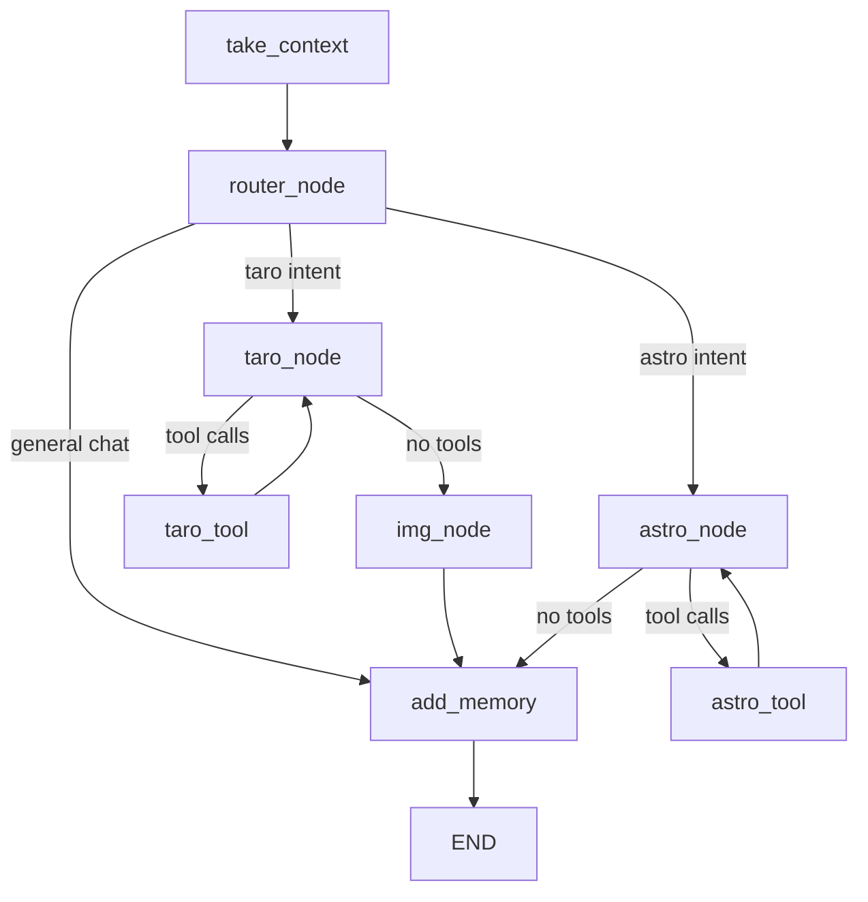

# AI-Taro

Multi-agent tarot and astrology assistant built with **LangGraph**, **FastAPI**, **Streamlit**, and **MCP** tool servers. Tarot cards are drawn deterministically via the tarot MCP server — not reconstructed by an LLM.

## Stack

| Layer | Technology |
|-------|------------|
| Orchestration | LangGraph multi-agent graph |
| API | FastAPI streaming `POST /stream` |
| Frontend | Streamlit chat UI |
| Tarot tools | TypeScript MCP server (`src/tarotmcp`) |
| Memory | Zep Cloud (long-term context + persistence) |
| LLM | OpenRouter-compatible models via LangChain |
| Observability | Langfuse (optional) |
| Tests | pytest + pytest-asyncio |

## Architecture



**Agent roles**

| Node | Model (via OpenRouter) | Role |
|------|------------------------|------|
| Router | `openai/gpt-5-nano` | Intent classification → taro / astro / direct reply |
| Tarot agent | `openai/gpt-5-mini` | Conversation + MCP tarot tool calls |
| Astro agent | `openai/gpt-5-mini` | Astrology conversation + MCP tools (deferred in v1) |
| Summarize | `deepseek/deepseek-chat-v3.1` | Compress exchange for Zep memory |
| Unlock card | `qwen/qwq-32b` | Spread layout unlock name (from MCP text) |

Cards are parsed from MCP `ToolMessage` markdown in `img_node` — no LLM card extraction.

## Quick start

### 1. Environment

```bash
cp .env.example .env
```

Fill required keys: `STREAM_API_KEY`, `OPENAI_API_KEY`, `ZEP_API` (plus PostgreSQL vars used by the app).

### 2. Python dependencies

```bash
uv sync
```

Uses `psycopg2-binary` (no system `pg_config` required).

### 3. Setup (env check + tarot MCP build)

```bash
uv run aitaro-setup
```

### 4. Run backend

```bash
uv run aitaro-api
```

API listens on `http://127.0.0.1:8000`.

### UI (optional)

```bash
cd src/frontend
uv run streamlit run login_menu.py
```

Set `STREAM_API_KEY` in `.env` so the Streamlit client can authenticate to `/stream`.

## API

`POST /stream` — NDJSON stream of `ExtractData` chunks.

Headers:

- `X-API-Key: <STREAM_API_KEY>` (required)

Body (`UserData`):

```json
{
  "message": "Draw three cards about my career",
  "user_id": "user-123",
  "name": "Alex",
  "birth_day": "1990-01-01",
  "time_birth": "12:00",
  "city": "Paris",
  "country": "France"
}
```

## Langfuse (optional)

Set in `.env`:

```
LANGFUSE_PUBLIC_KEY=
LANGFUSE_SECRET_KEY=
LANGFUSE_HOST=          # optional, defaults to cloud
```

When keys are absent, tracing is disabled and the app runs normally.

## Tests

```bash
python -m pytest -q
```

`pythonpath` includes `src/backend`. External services (LLM, Zep, MCP) are mocked in unit tests.

## Project layout

```
src/backend/server/   FastAPI HTTP layer (app, auth, schemas, observability)
src/backend/agents/   LangGraph workflow and domain models
src/frontend/         Streamlit UI
src/tarotmcp/         Tarot MCP server (Node/TypeScript)
tests/                pytest suite
```

## Security

- Never commit `.env`
- `/stream` requires `STREAM_API_KEY`
- See `docs/security-git-history-purge.md` if secrets were ever committed
